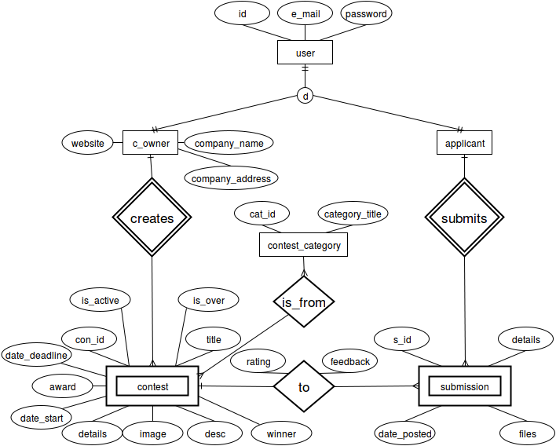

# Database Architecture

## Database Tables for Users
Existing Django models for users will be used. Additional fields for users will be added via profile models.

### Admins
- id
- username (e-mail)
- password

### Contest Owners
- id
- username (e-mail)
- password
- company name
- company address
- website

### Applicants
- id
- username (e-mail)
- password

---

## Database Tables for Contents
### Contests
- owner -> ForeignKey(C_Owner)
- title
- category -> Selected from a list of Categories
- description
- details
- image
- award
- is_approved -> controlled by Admins
- is_ongoing (Related to deadline)
- date_start
- date_deadline

### Submissions
- contest -> ForeignKey(Contests)
- applicant -> ForeignKey(Applicants)
- applicant name(s) -> filled by Applicant
- applicant details -> filled by Applicant
- submission details -> filled by Applicant
- files -> uploaded by Applicant
- date_posted
- feedback -> filled by Contest Owner (TextField)

### Winners
- contest -> ForeignKey(Contests)
- submission -> ForeignKey(Submissions)

---

### Schema Drawings

